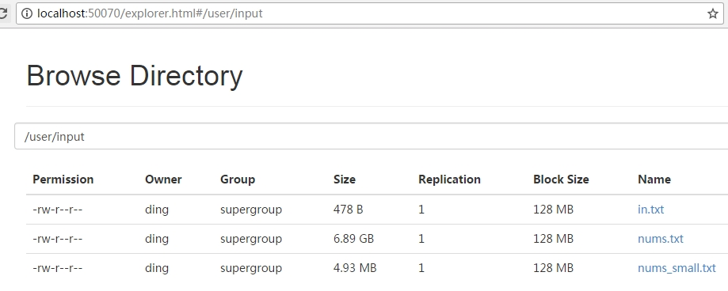
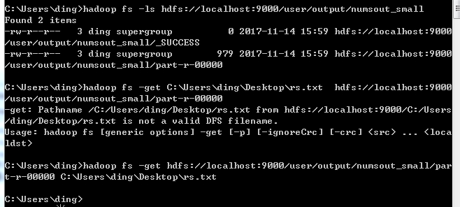
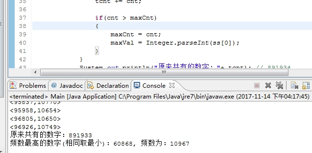

hadoop 实现ip的频数统计


* 随机数文件

source_file/nums_small.txt

java产生随机数，写入到文件中，然后再put到hdfs中




* 运行hadoop，java程序,结果也存到hdfs中

hadoop的过程一般有输入分片（input split）、map阶段、combiner阶段、shuffle阶段和reduce阶段。


* 从hdfs中get结果文件，然后可以测试

```
public static void testRs()
	{
		String rs_file ="C:\\Users\\ding\\Desktop\\rs.txt"; 
		
		FileInputStream fis = null;
		InputStreamReader isr = null;
		BufferedReader br = null; //用于包装InputStreamReader,提高处理性能。因为BufferedReader有缓冲的，而InputStreamReader没有。
		try {
			String str = "";
			String str1 = "";
			fis = new FileInputStream(rs_file);// FileInputStream
			// 从文件系统中的某个文件中获取字节
			isr = new InputStreamReader(fis);// InputStreamReader 是字节流通向字符流的桥梁,
			br = new BufferedReader(isr);// 从字符输入流中读取文件中的内容,封装了一个new InputStreamReader的对象
			
			int maxCnt = 0;
			int maxVal = 0;
			
			int tcnt = 0;
			while ((str = br.readLine()) != null) {
				// 当读取的一行不为空时,把读到的str的值赋给str1
				str1 += str + "\n";
				
				String ss[] = str.split("\t");
				System.out.println("<" + ss[0] +"," + ss[1] +">");// 打印出str1
				
				int cnt = Integer.parseInt(ss[1]);
				tcnt += cnt;
				
				if(cnt > maxCnt)
				{
					maxCnt = cnt;
					maxVal = Integer.parseInt(ss[0]);
				}
			}
			System.out.println("原来共有的数字："+ tcnt); // 891934
			System.out.println("频数最高的数字(相同取最小)："+ maxVal+", 频数为：" + maxCnt); // 891934
			
	  	} catch (FileNotFoundException e) {
	  		System.out.println("找不到指定文件");
	  	} catch (IOException e) {
	  		System.out.println("读取文件失败");
	  	} finally {
	  		try {
	  			br.close();
			    isr.close();
			    fis.close();
			    // 关闭的时候最好按照先后顺序关闭最后开的先关闭所以先关s,再关n,最后关m
	  		} catch (IOException e) {
	  			e.printStackTrace();
			}
	  	}
	}
```






